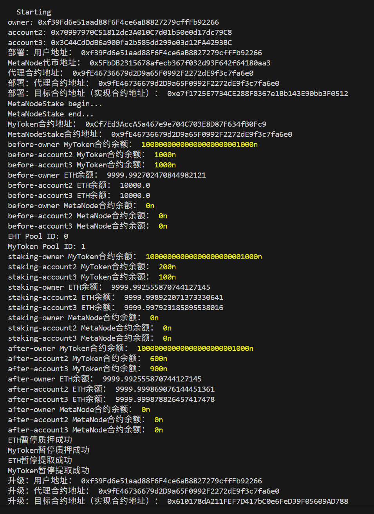

# 操作指南

## 安装依赖
npm install @openzeppelin/contracts-upgradeable
npm install -D hardhat-deploy
npm install dotenv
npm install @openzeppelin/contracts
npm install @openzeppelin/hardhat-upgrades

## 本地测试
### 本地模拟账号，且需要 --no-deploy参数，否则会自动执行deploy下的部署脚本
npx hardhat node --no-deploy 

### 部署/升级
npx hardhat deploy

### 测试脚本
npx hardhat test test/MetaNodeStakeTest.js

## sepolia测试
npx hardhat deploy --network sepolia

npx hardhat test test/MetaNodeStakeTest.js --network sepolia

